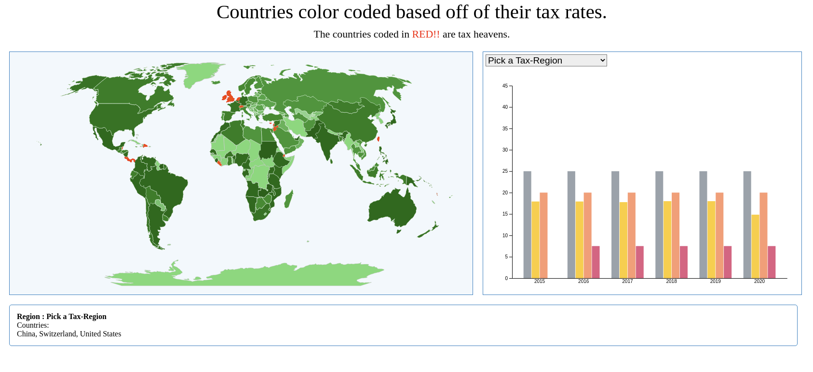

Assignment 4 - [Visualizations and Multiple Views](https://ashishjumbo.github.io/04-multiple-views/)  
===

For this analysis, I explored a topic that has been on the news recently due to President Baiden's tax proposals. For this analysis, I collected the tax rates for various countries worldwide and extracted their tax from 2015 to 2020. I also pulled the data for the commonly recognized Tax-Heavens. The data-set generation and preprocessing was run using Python.

For the visualization, I mapped a global map that a user can hover on to pull out the tax rates and other relevant information about the country where the darker shade of the color green represents the magnitude of the country's tax rates. I also plotted a bar chart to allow users to compare the tax rates between countries across multiple years. Countries can also be plotted with regions based on the taxation rules followed/practiced by the governments.   

Screenshot
-----------------

Both the Map and the Barchart can be interacted with to gain insight into current and past tax records of countries worldwide.

Technical Achievements
------------
- Implemented asynchronous approach to upload data using queue and d3 tags.
- Implementation of dynamic tool tooltips.
- Implemented custom callback functions that can be passed from the calling function so that the callback function can be called eventually when the task is complete

Design Achievements
----------------
- Implemented a world map view
- Arranged Div elements using flex displays to make the view more responsive
- I wanted to see if there are underlying patterns present in countries known as tax-heavens, and it doesn't seem that the tax rate or the geographical location of the tax-heaven plays a role. Interestingly however, most of the tax heavens seem to have easy access to seaports.

References:
------------------
- [d3 barchart tutorial](https://bl.ocks.org/mbostock/3885304)
- [d3 barchart example documentation](https://www.d3-graph-gallery.com/barplot.html)
- [d3 map tutorial](https://www.d3-graph-gallery.com/graph/choropleth_hover_effect.html)
