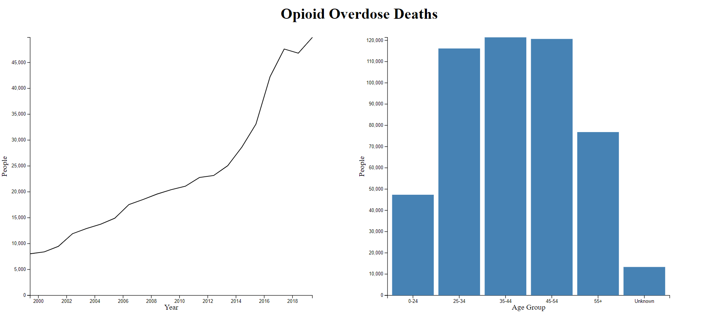

# Assignment 4 - [Visualizations and Multiple Views](https://cs573.ashwork.net/04-multiple-views)

## Description

This is a simple linked visualization on opioid overdose deaths based on a [dataset](https://www.kff.org/other/state-indicator/opioid-overdose-deaths-by-age-group/?activeTab=graph&currentTimeframe=0&startTimeframe=20&selectedDistributions=0-24--25-34--35-44--45-54--55--total&selectedRows=%7B%22states%22:%7B%22all%22:%7B%7D%7D%7D&sortModel=%7B%22colId%22:%22Location%22,%22sort%22:%22asc%22%7D) collected by the Kaiser Family Foundation. It displays the data into two parts: a line chart of the amount of deaths per year and a bar chart of the amount of deaths per age group. The line chart can be sampled from a specific time region while the bar chart can be selected on which age groups to consider.

## Technical Achievements

### Independent Sampling

When sampling data between the two charts, they are considered fully independent from one another. This means that brushing on a line chart will remain brushed even if the data is modified by the bar chart. The same goes for the bar chart where selected elements stay selected even if the line chart is brushed. As such, they move independent of each other.

### Concise/Proper Management

The Javascript used to generate the graphs are made in such a way that everything can be limited to four functions: one for initializing and one for updating for each type of graph. The functions are all commented on what each portion does. During transition animations, only dynamic information is present to keep equal selections. Brushed data is transitioned on end so that data is updated only once per brush set. Data is only constructed for the graphs whenever they are updated. Finally, CSV parsing is handled separately to cache initial dimensions and then pass subsets of those dimensions into the graphs.

## Design Achievements

### 'At Least One' Selection

No matter on which chart, you will always have at least one element selected. This is because looking at data with no selections is pointless. Line charts can sample a region or the whole chart if nothing is selected. Bar charts will not allow the last bar to be removed from consideration if all other bars have been as well.

### Noticeable Selections

All selected elements are obvious and notable in each graph to know which data is being sampled. Line charts have an overlay containing the selected data. Bar charts are blue when selected and grayed out when not.

### Animations

Both the line chart and bar chart are animated to get to their new positions after sampling.
