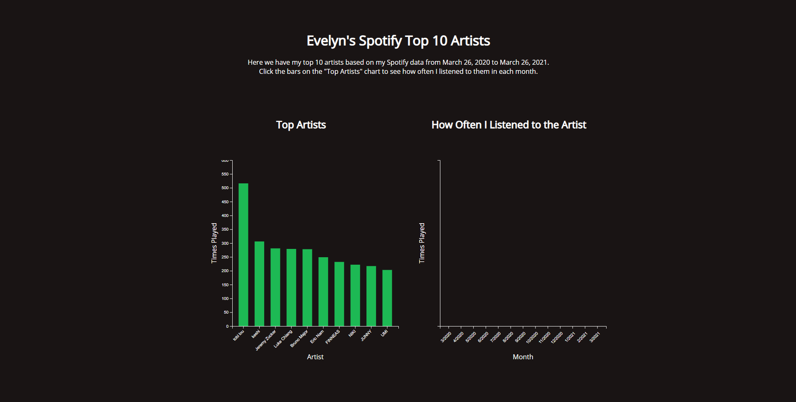
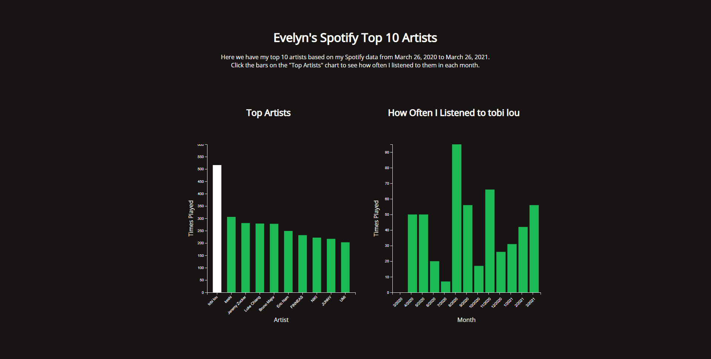
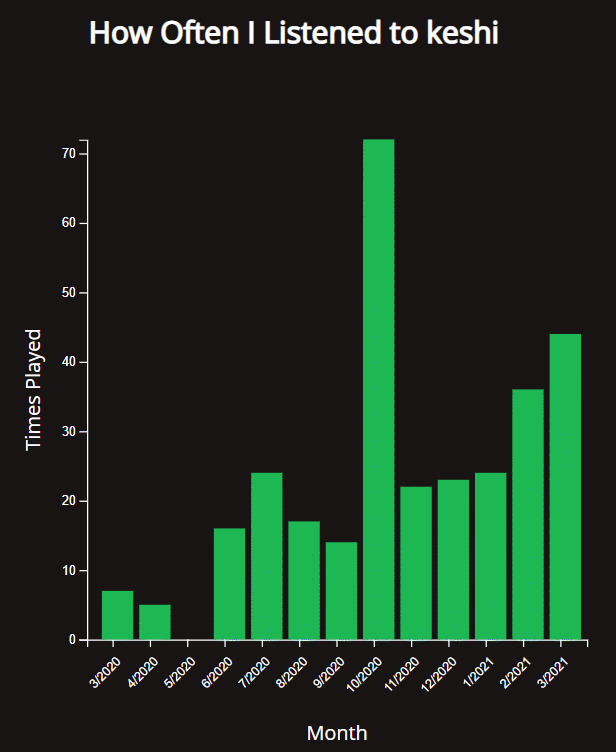
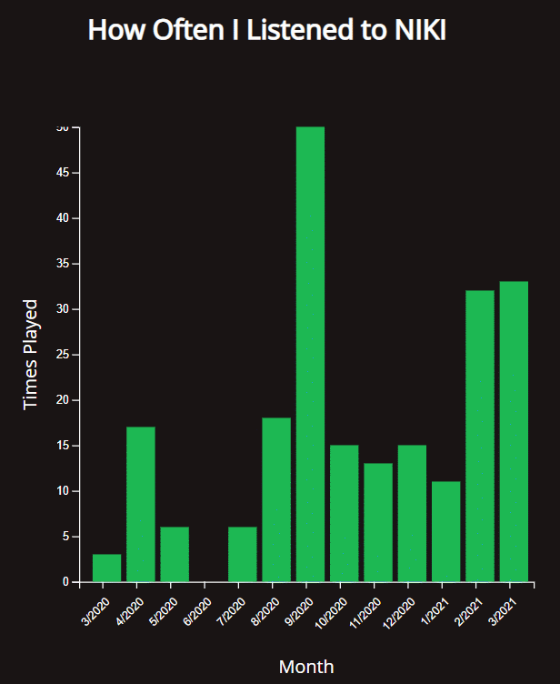
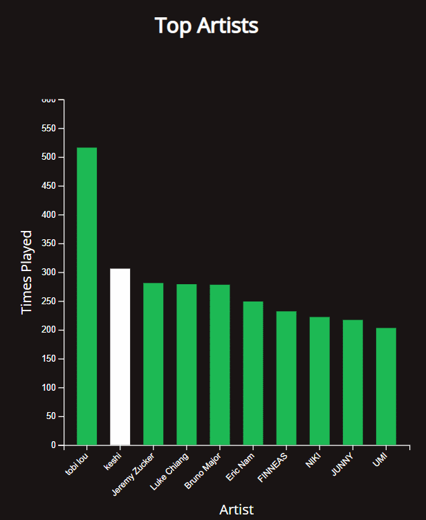

Assignment 4
==
[Link to Visualization](https://evelyntrvn.github.io/04-multiple-views/)
## Description
For this assignment, I used my personal Spotify data from March 26, 2020 to March 26, 2021. It took me a bit to figure out what I was going to do with the data, but I decided to focus on my top 10 artists to utilize the top() function in the crossfilter library. 

To visualize this data, I have 2 bar graphs. The first displays my top 10 artists and how often I played their songs during the year. When clicking on the bar, the bar graph on the right will update and display how often I played that specific artist in a given month. 

## Screenshots
- Default Page

- Selected Artist

## Technical Achievements
- **Crossfilter Dimensions and Filtering** : This was probably the hardest for me to understand and figure out. Once I got the concept, I based my visualizations on what I could do with the crossfilter. It allowed me to filter through all my data, such as filtering for specific artists.
- **Tooltip** : When hovering over a given bar, a tooltip appears and shows the exact value of the data.

- **Dynamic Y-axis** : When changing between artists, the y-axis on the bar graph on the right side will adjust itself to better fit the data of the selected artist.

## Design Achievements
- **Animation** : I played around a lot with the animation from the color changing, to the bar graph growing, to the y-axis changing to create a more seamless visual.
- **Color Scheme** : I tried to match the colors of Spotify to stick with the theme. In addition to that, when hovering over a bar, the bar will highlight and will turn white when clicked on. 

- **Updating Title** : The title on the bar graph on the right will update to whichever artist was selected.

## References
- https://danayao.com/design/my-spotify
- http://square.github.io/crossfilter/
- https://eng.wealthfront.com/2012/09/05/explore-your-multivariate-data-with-crossfilter/
- https://www.animateddata.com/articles/crossfilter/