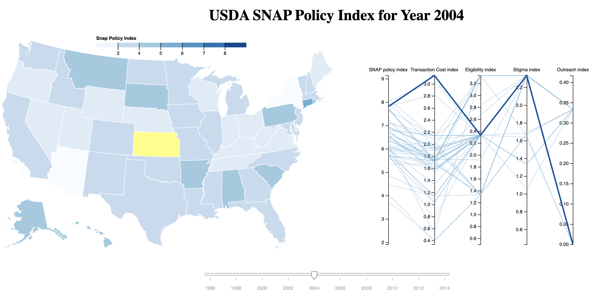

Assignment 4 - Visualizations and Multiple Views  
===
[My Multiple View Visualization](https://ephie06.github.io/04-multiple-views/)

Two types of visualizations that I wanted to try were a map and a parallel coordinates chart. I found an interesting interactive visualization on the USDA's website ([SNAP Policy Database: Interactive Tool](https://www.ers.usda.gov/data-products/snap-policy-data-sets/snap-policy-index-interactive-tool/)). I used the same data set to create something similar but with a parallel coordinates chart instead of small multiples (and with d3 instead of Tableau :-). There is a slider that changes the charts for the data for the year. And when you click on a state the state and it's corresponding line in the parallel coordinates chart are highlighted. There is also a tooltip that displays the state and SNAP Policy Index for the map. Please maximize your browser window so the charts are next to each other as intended. 

References
---
I did not write the code from scratch and used the following examples:

1. [State Choropleth](https://observablehq.com/@d3/state-choropleth)

2. [Zoom to Bounding Box](https://observablehq.com/@d3/zoom-to-bounding-box?collection=@d3/d3-geo)

3. [Basic parallel coordinates chart](https://www.d3-graph-gallery.com/graph/parallel_basic.html)

4. [Interactive Visualization using d3](https://github.com/Rama-C/Interactive_Visualization_using_D3)

5. [d3 Slider](https://github.com/MasterMaps/d3-slider)

6. [d3 Simple Slider](https://github.com/johnwalley/d3-simple-slider)

7. [Color Legend](https://observablehq.com/@d3/color-legend)

Technical Achievements
---
- Implemented new-to-me chart types of map and parallel coordinates.
- Interactive slider updates both charts for that year's data and the heading.
- Color legend for the map.
- Tooltip showing the state's name and SNAP policy index.

Design Achievements
---
- Matching the colors of the charts and a complimentary color for highlighting. Color scheme improved from the original. 
- Working with the div elements to get the layout I wanted.
