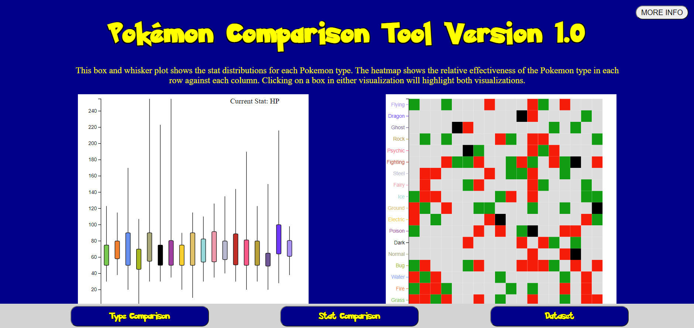
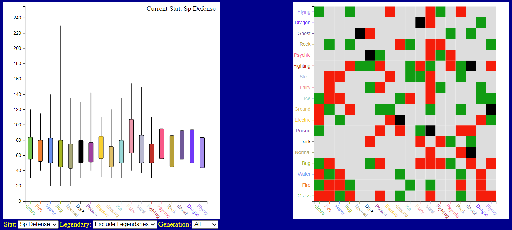
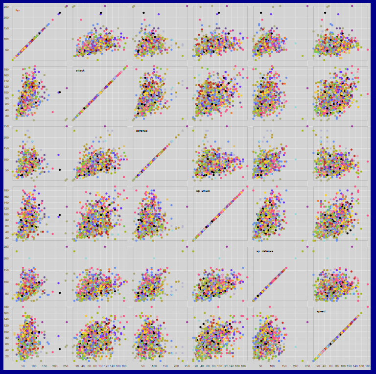
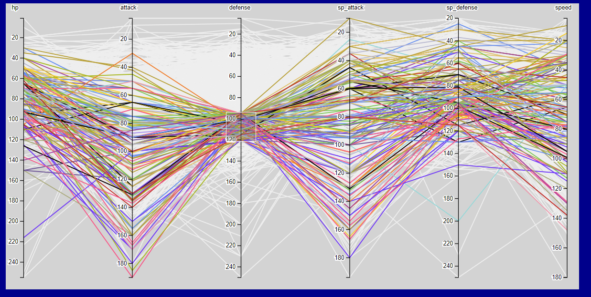
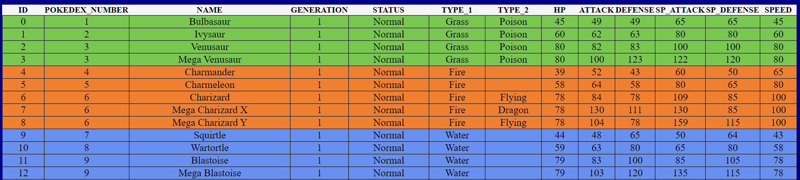

Assignment 4 - Visualizations and Multiple Views  
===
By: Andrew Nolan

Link
---
http://acnolan.tech/04-multiple-views/

Project Overview
---
The task of this project was to choose an interesting dataset and visualize it in at least two linked views, where interactions in any given view updates the others. Each view should use a different visualization type, and interaction in one of the views should impact what's shown in the other views.

Design Description
---
For this project I was having trouble coming up with a good data set to use. On Twitter me and some friends were doing a bracket of voting on our favorite Pokémon. I thought Pokémon statistics could be a fun dataset for a visualization. Searching the internet I found a nice dataset on [Kaggle](https://www.kaggle.com/mariotormo/complete-pokemon-dataset-updated-090420?select=pokedex_%28Update_05.20%29.csv) [4].

To analyze this data I created a data table and four visualizations, a box and whisker plot, a heatmap, a scatterplot matrix, and a parallel axes graph. We needed to create linked visualizations so I made two sets of linked views out of the four visualizations used.

The first page is the Type Comparison page. This page provides a multiform overview of the Pokémon type data by showing encodings of different subsets of data. The box and whisker plot shows summary statistics (range, max, min, Q1, Q3) of a stat for each Pokémon type. It has drop downs to change the stat, or to filter the data to a specific generation of Pokémon or to remove legendary Pokémon. The heatmap shows the relative effectiveness of the type in the row with respect to the type in the column. Clicking on a cell will highlight the types in the box and whisker plot. Clicking on the rectangles in the box and whisker will highlight the type in the heatmap.

The second page is the Overall Stat Comparison page. This page includes a brushable scatter plot matrix and a brushable parallel axes graph. Both depict the stats of each individual Pokémon (represented as a dot or line respectively) and colored by the Pokémon's type. Showing all of the data in two different visualizations provides a multiform view of the dataset. Brushing either visualization will highlight the selected Pokémon in both visualizations.

The final view is the dataset view. This page includes the dataset used for the visualizations. Like the other graphs, the rows of the data are colored by type_1. The source of this data is from [this Kaggle page]("https://www.kaggle.com/mariotormo/complete-pokemon-dataset-updated-090420?select=pokedex_%28Update_05.20%29.csv"). I did feature reduction to make it more readable and useful for my comparison tool.

Additionally, the overall website has a More Info button that opens a modal with the information about each page as well as a legend for the color channel. All of the visualizations are colored by the primary type of the Pokémon. The bottom of the page includes a nav bar that allows the user to switch between the three pages.

### Known Problems
1. The scatterplot matrix has a width of 1200px. Therefore, your browser will likely need to be maximized to properly fit the visualizations correctly.
2. The dataset is very big and thus the scatterplot matrix and parallel axes can be very slow when brushing. The filters reduce the data and improve performance.
3. Hovering over the lines in the Parallel Axes plot shows a tooltip with the name of the Pokémon using svg.append("title").text("some string"). The scatter plot should also show names when hovering over the dots in the graph. However, because the sibling element of the brushable area is drawn over the dots it steals the mouse events. I tried to work with Professor Harrison and Ryan during April 22nd's A4 work session to figure out a solution. Unfortunately, I was not able to find an adequate solution, so the tooltips on the scatter plot matrix, unfortunately, do not work.

Technical Achievements
---
- **Four different visualizations:** Instead of just making two linked visualizations, I made two pairs of linked visualizations, four viz in total (box and whisker plot, heatmap, scatterplot matrix, and parallel axis).
- **Filterable data:** There are filters for the box and whisker plot, the scatterplot matrix, and the parallel axes plot to reduce the amount of data used for the graph. The box and whisker plot also has a dropdown to change which statistic is displayed.
- **Modal popup:** I created a modal popup to provide more information. I built it using JS, CSS, and HTML.

Design Achievements
---
- **Custom CSS:** For this assignment I made custom CSS style sheets to style the website. 
- **D3 Animations:** The box and whisker plot has animations when the boxes and lines change if a different stat is selected or when the data is filtered.
- **Multi Browser Suppport/Testing:** I tested the code in Chrome and Firefox on a 1536x864 monitor and a 1920x1080 monitor. It works correctly in both browsers at both sizes.
- **Fun Fonts:** I was able to find the Pokémon font[1] and use it in the website.
- **Consistent/Appropriate coloring:** The visualizations and data table are color coded consistently to represent the different Pokémon types. These colors are consistent with those used in official Pokémon products.

References
---
1. Pokémon Font - https://www.onlinewebfonts.com/download/f4d1593471d222ddebd973210265762a
2. Bottom Navbar - https://www.w3schools.com/howto/tryit.asp?filename=tryhow_css_bottom_nav
3. HTML Modal - https://www.w3schools.com/howto/howto_css_modals.asp
4. Dataset - https://www.kaggle.com/mariotormo/complete-pokemon-dataset-updated-090420?select=pokedex_%28Update_05.20%29.csv
5. Boxplot - https://www.d3-graph-gallery.com/graph/boxplot_several_groups.html
6. Heatmap - https://www.d3-graph-gallery.com/graph/heatmap_tooltip.html
7. Scatterplot Matrix - https://observablehq.com/@d3/brushable-scatterplot-matrix
8. Parallel Axis - https://observablehq.com/@d3/brushable-parallel-coordinates
9. Table - https://www.valentinog.com/blog/html-table/