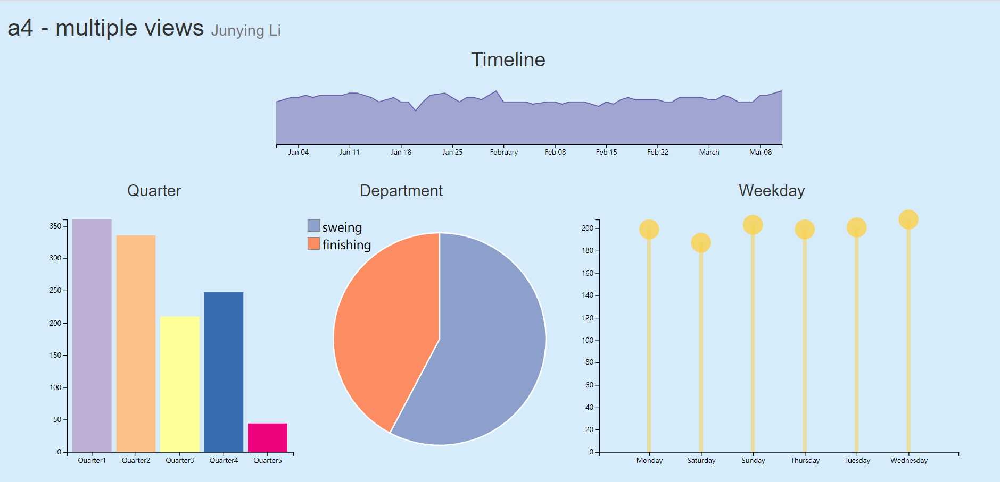
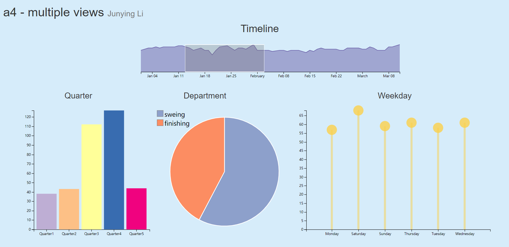
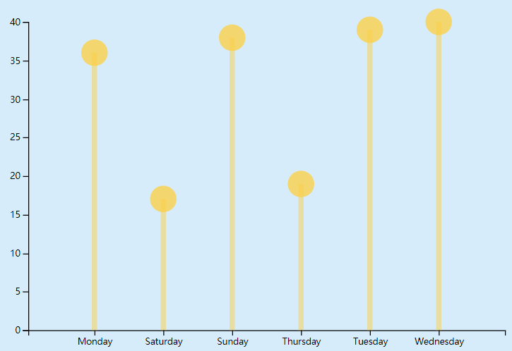
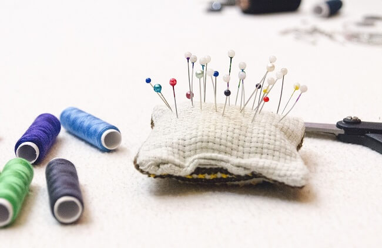

# Assignment 4 - Visualizations and Multiple Views

GitHub Page Link:

Data source: [garments worker productivity](https://archive.ics.uci.edu/ml/datasets/Productivity+Prediction+of+Garment+Employees) Abdullah Al Imran (abdalimran@gmail.com)

## Concise description 

The Garment Industry is one of the key examples of the industrial globalization of this modern 
era. It is a highly labour-intensive industry with lots of manual processes. Satisfying the huge
 global demand for garment products is mostly dependent on the production and delivery 
 performance of the employees in the garment manufacturing companies. So, it is highly desirable 
 among the decision makers in the garment's industry to track, analyse and predict the 
 productivity performance. 
 
 I choose 4 kinds of visualizations to help users analyze workers workload. To show the workload
  of all workers over time, I made use of time series chart. To show the workload of all workers in 
  different quarters, I made use of bar chart. I use pie chart to show performance of departments, 
  and lollipop chart to show workload in different weekdays.
  
The four charts above are linked, when we create a brush window on time series chart and move it
 horizontally, the other three charts will change to show the filtered data. In addition, when we
  mouse over bar chart and lollipop chart, the other three charts will change too.
  
## Result analysis

According to the visualizations I've made, it indicates that workers did more work in Quarter 1 than
the other 4 quarters from January 1st 2015 to March 11th 2015. For weekdays, workers did the least 
work in Saturdays, and did the most work in Wednesdays. Which confirms the same result of a research
made by Alex Bryson and John Forth in 2007, employees do the most work on Wednesdays[1].
 As for the departments, the department of sweing* always did more work than the department of 
 finishing. In quarter 2, department of finishing has the highest percentage of workload.
 
*In the dataset, this department's name is sweing. I'm not sure if it's a typo, so I just keep it.
  
## Screenshots

*figure 1 - initial look*

*figure 2 - with brush*

## Technical achievements

- Link charts by Crossfilter and d3 Brush 

## Design achievements

- Design a lollipop chart. 

Since the dataset is about the garment industry, I designed a lollipop chart which looks like sewing pins.

## References

[1] Bryson, A. and Forth, J. ORCID: 0000-0001-7963-2817 (2007). Productivity and Days of the Week. London, UK: RSA.