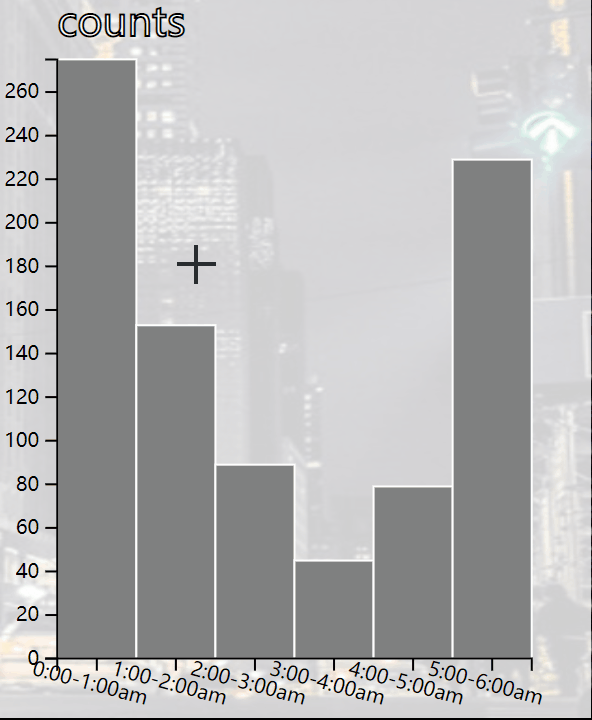

Assignment 4 - Visualizations and Multiple Views  
===

Link: https://zihao777.github.io/04-multiple-views/    
     
The visualization I created is based on New York City yellow taxi trip recorded (source: https://www1.nyc.gov/site/tlc/about/tlc-trip-record-data.page). The dataset stores many kinds of information such like trip distance, pick up location, destination, total amount fare etc. I choose the data which passenger was picked up from 0:00 AM to 6:00 AM on December 1st. The main idea is that users can interact with charts or slide bar to explore where taxis carry passengers most frequently or explore their routes in the early hours of New York in the map.
     
Page is divided into five part. On the left side of the page, there are two slide bars. Users can drag them to select data in a specific interval. In the middle of the page, there are heat map and map which shows trip path. Users can switch them by click button on the top right corner. The GeoJson file to create map is from the NYC open data(source: https://data.cityofnewyork.us/Transportation/NYC-Taxi-Zones/d3c5-ddgc). On the right side of the page, there are scatter plot chart and bar chart. Scatter plot chart shows the relationship of trip distance and total amount fare. The bar chart shows the number of passengers carried in different time interval. On the bottom of the page, the detail information of chosen data is displayed there.     
    
Interactive in slide bar or scatter plot chart or bar chart will impact what is shown in other view. For example, if you brush in the scatter plot chart, the number of passengers carried at different time interval will change to match the selected data in scatter plot chart. At mean time, slide bar will change to match with interval of selected data in scatter plot.       
     
There are several interesting details in the page. No matter what area you brush in the bar chart, it will always automatically transform to the smallest sharp point interval that contains it. The clock pattern allows the user to more intuitively know the time interval of the selected data.     
   
     
Technology Achievement:
----
1.	link the slide bar, scatter plot chart, bar chart, map, dash board together. In bar graphs, scatter graphs, and sliders, interaction in one of these chart or slide bar will impact other views or slide bar.     
2.	Area in bar chart will automatically transform to the smallest sharp point interval that contains it.   
     
Design Achievement:
-----
1.	The layout of various graphics and sliders has been carefully designed so that they don’t look cluttered
2.	Many transition animations are used in the design, such as map switching and bar chart changes.
     

