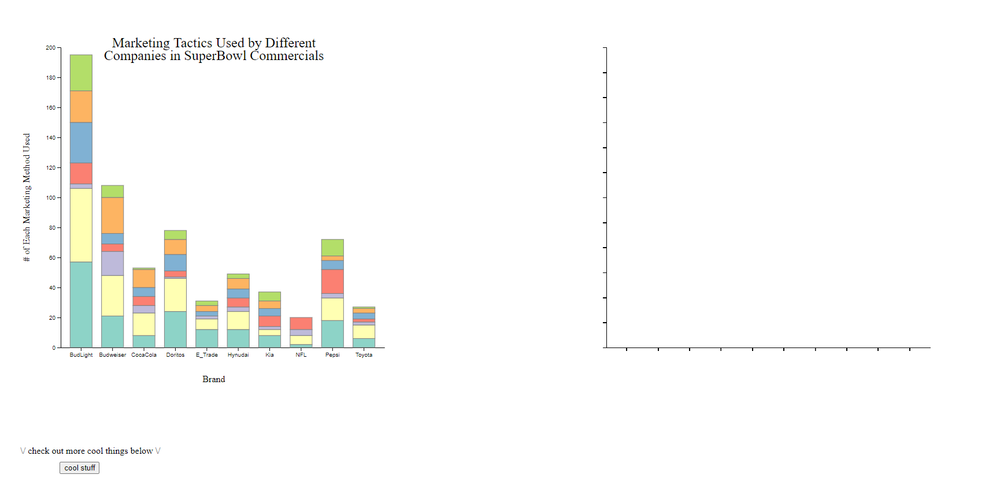
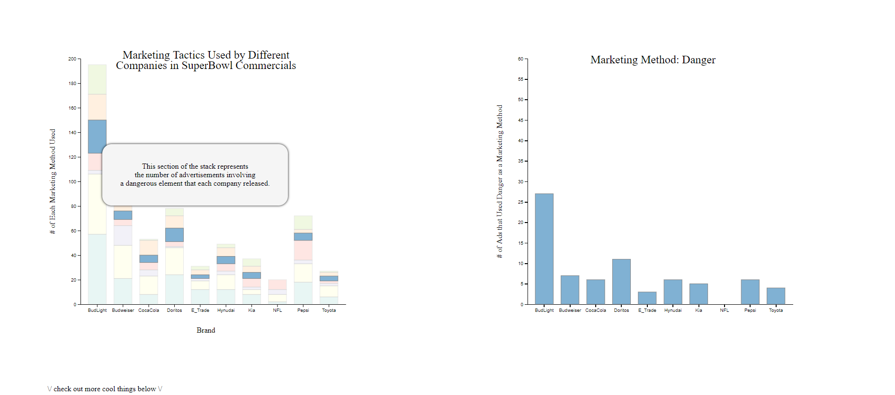
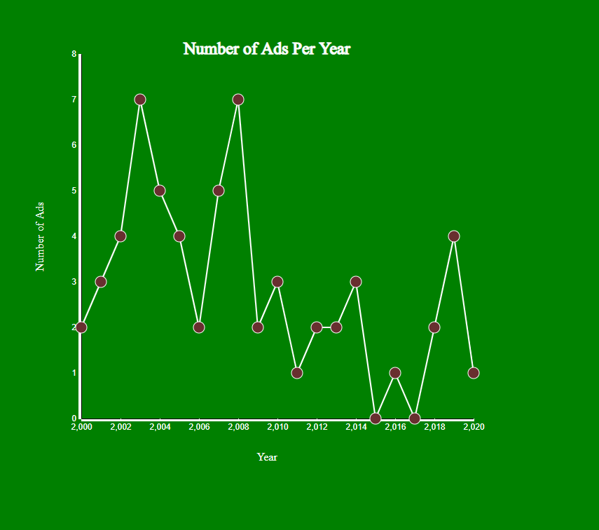
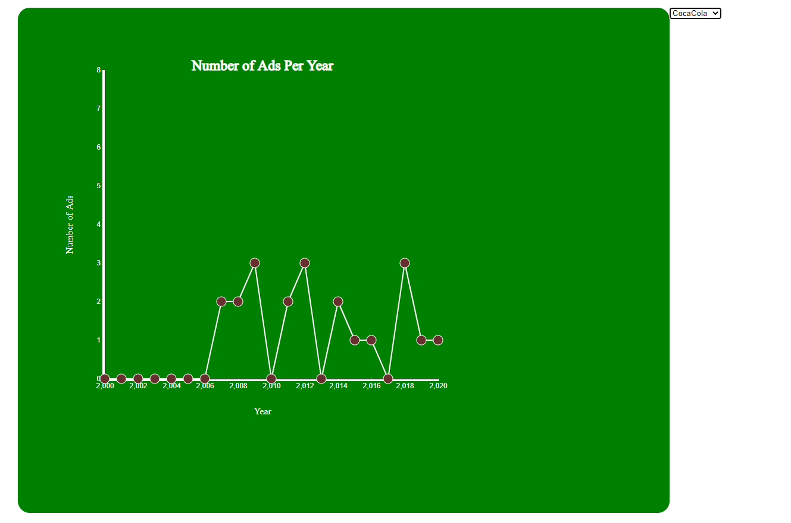

Assignment 4 - Visualizations and Multiple Views - Gabrielle Acquista 
===
Here is an active link to my page: https://geacquista.github.io/04-multiple-views/

Requirements
---
For this project I found a dataset on Data is Plural that had various information on Superbowl commercials over the past 20 years (original.csv).
After a lot of data processing to fit the needs of the project, I came up with a multiple views visualization that links a stacked bar chart to a typical bar chart.
Organized by brand, the main view uses colored stacks to represent different marketing tactics used in their commercials.
So, the bigger the stack, the more ads that brand made incorporating that specific tactic. 
Upon hover over a certain section, the selected marketing tactic pops up in its own view so the information is clearer to see.
On another page, I've included a transforming connected scatter plot using data I compiled from the same set.
In this chart, you can select a brand to see how many ads they put out each year over the pat 20 years. 
I decided to include this because some brands created a lot more content than others, which may skew how a user analyzes the visualization.
This additional component helps put this factor into consideration in a fun and interactive way.

Below are some screenshots of the completed visualization.

Technical Acheivements
---

### Tooltip

*I consider this a technical acheivement because of how much debugging it required.
*I was able to get it to appear only on hover and follow the mouse around.
*This was a really fun way to add more information about what was going on in my vis without cluttering up the screen.

### Scatterplot

*This was an extra visualizing element not required for the multiple views assignment.
*I figured that a dropdown menu would be a fun way to explore more of d3.

### Functions

*This was the first project that I truly came to understand using functions in Javascript.
*Because I wanted to change certain elements of the chart depending on the brand, I was able to add a lot more "meat" to my functions.

Design Acheivements
---

### CSS
*I played around with a lot of CSS/HTML elements to make this visualization a lot more visually appealing.

### Theme
*Like the point above, I made a lot of design decisions to stick with a theme of football because the data comes from Superbowl ads. 

### Animations
*For the linked view the bars animate up from the x-axis.
*For the scatterplot, changing the selected brand shifts the lines/dots so it looks easy on the eyes.

Referenece
---
Shoutout to the D3 Graph Gallery for giving me a groundwork to make this visualization. https://www.d3-graph-gallery.com/
