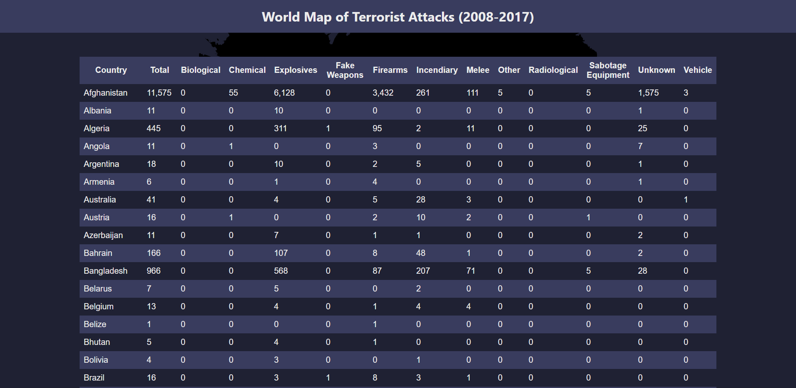

Assignment 4 - Visualizations and Multiple Views  
===

## Link to Visualization

https://04-multiple-views.ryanlamarche.dev/

## The Data

Data can be found in `public/data/Terrorist attacks by weapon type - Global Terrorism Database (2018).csv`

Data Source: [Our World in Data github](https://github.com/owid/owid-datasets/tree/master/datasets/Terrorist%20attacks%20by%20weapon%20type%20-%20Global%20Terrorism%20Database%20(2018))

## Description

This visualization aggregates geoJSON data with a public terrorism dataset provided by Our World in Data. The goal was to create a visualization that users could use to explore the weapon types used in terrorist attacks in different regions of the world. This can be helpful for identifying geospatial patterns to terrorist attack types.

One thing I noticed while brushing over the map in this visualization is the difference between countries in the Middle East (which have a higher percentage of Explosives attacks) and countries in Southern Africa (having a higher relative percentage of Firearms attacks). It was also interesting to click countries in the table and make comparisons, such as comparing the United States with countries like Canada and Australia which have stricter gun laws (resulting in a lower percentage of Firearms terrorist attacks).

### The visualization consists of:

* __A Bar Chart__ - showing the distribution of weapon type for the currently selected countries
* __An Interactive World Map__ - a "brushable" world map using the `d3.brush()` API. The brush "selects" countries by comparing the user's current selection with the centroid of points for each country in the geoJSON dataset. This allows the user to select different regions of the world and explore geospatial trends.
* __A Table__ - below is a table, which is also filtered when the user brushes over the world map. This lets the user see the individual data points to make precise comparisons and draw conclusions. The __country name__ is also clickable, which will filter the map to just that 1 country. This makes it possible to filter the bar chart to see just 1 country at a time.
* __A Help Button__ - A help button that opens a modal to help people get started using this visualization.

## Screenshots

### The help menu

### The world map and bar chart with legend

### The table below the map

### Brushing over Northern Africa

### Clicking "United States of America" in the table

# Technical Achievements

* The countries are colored using a logarithmic scale

* Brushing over countries using `d3.brush()` and computing the `centroid` of each country from a set of points in geoJSON data

* Brushing over countries using `d3.brush()` and computing the `centroid` of each country from a set of points in geoJSON data

# Design Achievements

* "Pulse" Animation when you click a country in the table - this makes the country "grow and shrink" in an animated way to help the user find the country they clicked on and avoid "change blindness."

* "Help Button & Modal" to help users who have not used this visualization before get started and better understand what they're looking at.

* Dark Theme - Avoid eye strain at night when looking at this visualization; appeals to Computer Science majors.

# Future Work

After spending some time with this visualization, I think it would be helpful to allow users to select more than 1 country in the table for a "direct comparison" task. I found myself clicking the table, trying to remember the bar chart, then clicking a different country in the table and trying to make a memory-based comparison. The primary goal of this visualization was to allow users to explore geospatial patterns (by selecting regions of the world using the brush tool), but the comparison tasks were also interesting and helpful, so I think if I build a "Version 2" of this tool, I would explore a more robust direct comparison method.

It's also worth mentioning that the brush might not be the "optimal" tool for world maps. I had to use the centroid for performance reasons, rather than testing every single point in the entire map, but filtering the countries based on the centroid of the geoJSON data for each country can become "clunky" in countries like the US, because Alaska and Hawaii skew the centroid. I wanted to use `d3.brush()` in this assignment to explore the API and see what works and what doesn't, but a "Version 2" of this tool might drop the brush tool in favor of simple "on click" event listeners to add/remove countries for comparison.
