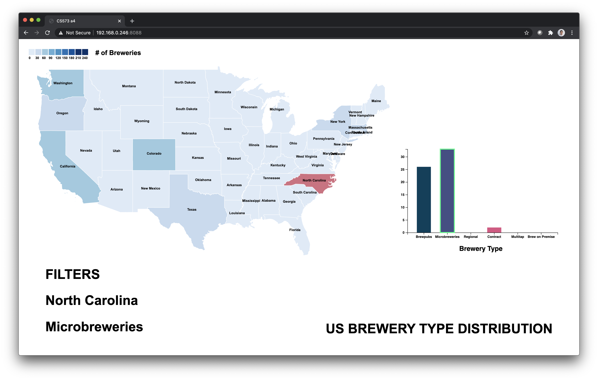

Assignment 4 - Visualizations and Multiple Views  
===

Author
---
Joseph Yuen

Project Link
---
https://jhyuen.github.io/04-multiple-views/

Project
===
### Description
I explored the distribution of breweries in the US. Even though I am not overly familiar with this topic, there are 6 main types: brewpubs, microbreweries, regional, contract, multitap, and brew on premise. 

To visualize this data, I created an interactive map linked to a bargraph in d3. By default, the map shows the total number of breweries in each state through color. As you can see, California has the most breweries likely due to its popular brew culture and larger population.

A user can click on a state and discover the distribution of breweries in that state in the bargraph to right. Each bar represents a brewery type and is shown next to the other types for easy comparison. A user can click on the bars for each type of brewery. Doing so will update the colors on the map. Once a type is selected, then the number of only that type of brewery is colored. In short, the map changes the distribution of the bargraph, and the bargraph changes the colors of each state.

Note: Please in a full screen browser for an optimal experience

### Screenshots
Default

State Filter

Brewery Filter

State and Brewery Filter

Achievements
===
## Technical
1. **Python Data Cleaning** - I originally found this dataset on Kaggle as it had a 10/10 usability rating. Despite this rating, the data did not have any data for Mississippi and included Puerto Rico and D.C as states. I discovered this fact through manipulating the data with Pandas dataframes and Numpy functions. For Mississippi, I set all of its NaN values to 0 so that it would still show up as a state. I also performed some data manipulation in Excel to add an entry for the entire United States.

2. **Tooltip** - In the bargraph that displays the distribution of brewery types, I added a hover tooltip that shows the actual value of the selected bar as seen in the image below.

3. **Manipulated GeoJson Data** - In order to save space and allow the mainland states to be readable, I deleted Alaska and Hawaii coordinates in the JSON file so that it would not be drawn on the map.
4. **Bargraph Dynamic Y-Axis** - Instead of keeping the same y-axis values for each state, I configured the graph to make the largest bar as the max for the given graph. Doing so allows the users to more easily see the other categories. 

## Design
1. **Eliminated Alaska and Hawaii** - When I initially drew the map with the geojson data I found online, Alaska and Hawaii were extremely large and shrunk the size of the US mainland. To make an easier reading experience, I deleted Alaska and Hawaii in the design of the vis. 
2. **Created Custom Map Key** - The method I used to make the map did not include a built in function to create a map legend. By using my colorscale intervals, I created a custom key to show what each color represents.

3. **Current Filter Text** - Although I use colors to show the filtered state and filtered brewery type, I wanted to also have another method to show the user what they've selected. Even though it's relatively simple, I believe this is necessary just in case a user is not able to notice the highlights I implemented. 

Resources
===
- https://medium.com/@ivan.ha/using-d3-js-to-plot-an-interactive-map-34fbea76bd78
- https://www.d3-graph-gallery.com/graph/choropleth_basic.html