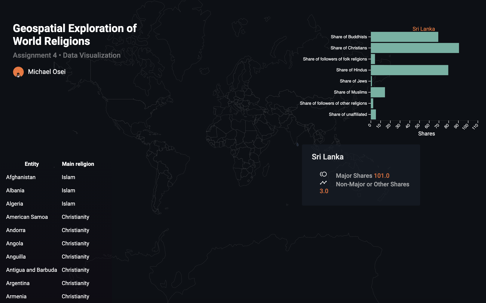

Assignment 4 - Visualizations and Multiple Views  
===

## Link
https://mike3osei.github.io/04-multiple-views/index.html

## Description 

The Geospatial Exploration of World Religions is an application that takes the religious experience of the world and tries to tell a story about diversity in faith within our global communities. The data talks about the percentage of shares of faith that are found in each communitiy. This is a good way of measuring similarity in faith across different regions in the world.

Special thanks to D3 Graph Gallery for their examples in maps, animation and geoJson data examples. I pulled a lot of influence from how they managed their code. Another special thanks to Crossfilter and their fast multidimensional filtering for coordinated views. I took a lot of inspiration from them as well.

https://www.d3-graph-gallery.com/backgroundmap
http://square.github.io/crossfilter/

Without you all this application would not be possible.

## Screenshots 

## Technical • Achievements  

The data which was used, had to be normalized throughout because it was not clean data. The CSV combined two different separate data types and filtering / mapping all of them at scale was technically challenging.

I utilized Dispatch Events to handle the synchronization of the charts or different views as well.

As one hovers over a country separate information relative to that specific place arrives. I was able to keep the hover dialog attached to the cursor or pointer as well which made the datavis pretty unique.

## Design • Achievements  

Previously I had never implemented any form of animation in my data visualizations. I was able to utilize d3 animations to transition throughout the hovering of countries.

As scales the screen you'll notice that the responsiveness of the application stays in tack. It was challenging with px base system but I made use of percentages to more help the user experience on different screens.

Implemented external icon library to more adequately represent what was going on in the visualization.
